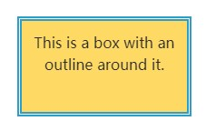

#### outline

outline是outline-style、outline-width、outline-color的简写

```
div {
  outline: thick double #32a1ce;
}
```

效果图



语法

```
outline-style: auto;
outline-style: none;
outline-style: dotted;
outline-style: dashed;
outline-style: solid;
outline-style: double;
outline-style: groove;
outline-style: ridge;
outline-style: inset;
outline-style: outset;

/* Keyword values */
outline-width: thin;
outline-width: medium;
outline-width: thick;

/* <length> values */
outline-width: 1px;
outline-width: 0.1em;
```
---
#### content
*content* 是专用于伪类（::before）的重要属性.
1. 可以直接取到html元素属性值
2. 可以在元素前后添加icon或图片

```
div::before{
  content: attr(id)
}
```
```
<div id="hello">这后面有属性</div>
```
---

#### box-shadow

box-shadow 的四个数字属性值+颜色的意义要理解透彻


